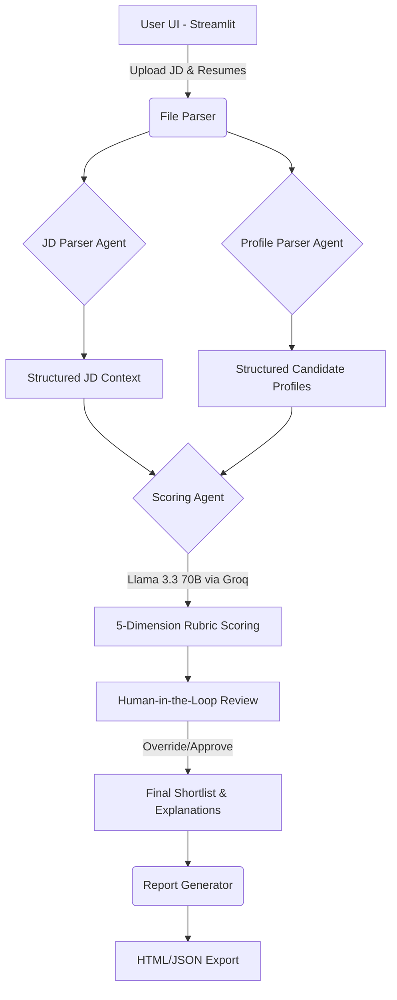

# 🚀 AI-Powered HR Shortlisting Agent

[](https://ai-scored-shortlist.streamlit.app/)


An advanced, AI-driven recruitment intelligence application built with **Streamlit** and powered by **Groq (Llama 3.3 70B)**. 

This agent automates the initial resume screening process. It parses a Job Description (JD) and candidate resumes, evaluates them against a dynamic 5-dimension rubric, and generates a ranked, scored shortlist in seconds.

## ✨ Features
- **Deep Space UI:** Stunning, neon-themed glassmorphism interface.
- **Lightning Fast Inference:** Uses Groq's high-speed inference for immediate resume parsing.
- **5-Dimension Rubric:** Candidates are evaluated across 5 key areas tailored dynamically to the JD.
- **Human-in-the-Loop (HITL):** HR professionals can review AI reasoning and override scores with audit logging.
- **Exportable Reports:** Instantly generate and download visually rich HTML reports or raw JSON data.

## 🏗 Agent Architecture Diagram



## 🧠 LLM & Framework Choice

### 1. LLM Choice: Meta Llama 3.3 70B (via Groq)
**Rationale:** Llama 3.3 70B offers exceptional reasoning capabilities necessary for subjective scoring across a nuanced multi-dimensional rubric. By running it on Groq's LPU inference engine, we achieve lightning-fast token generation, allowing batch processing of multiple resumes in seconds without user friction.

### 2. Framework Choice: Streamlit
**Rationale:** Streamlit enables incredibly rapid prototyping of a clean, interactive Python-native web application. It seamlessly supports the necessary Human-in-the-Loop (HITL) review mechanisms through native components (like expanders and text areas) without requiring a completely separate frontend/backend architecture.

### 3. Data Structuring: Pydantic
**Rationale:** Using Pydantic ensures the LLM outputs strictly adhere to a predefined JSON schema (for scoring dimensions and justifications). This acts as a robust intelligence layer that prevents parsing errors downstream.

## 🛡 Security Mitigations

- **Secrets Management:** API Keys are loaded securely from Streamlit Cloud Secrets (production) or an explicitly git-ignored local `.env` file (development). No credentials are ever hard-coded.
- **Stateless Execution:** The application runs completely stateless. Candidate resumes and extracted evaluations exist solely in memory during the active user session and are never persisted to a database or disk, ensuring applicant privacy.
- **Human-in-the-Loop:** AI hallucinations or biases are mitigated by the HITL workflow, enforcing that a human recruiter audits and approves the final candidate scoring before any definitive action is taken.
- **Input Sanitization:** Uploaded files undergo robust parsing and error handling to ensure only valid text/PDF/DOCX documents are processed.

## 🛠 Setup & Installation

1. **Clone the repository:**
   ```bash
   git clone https://github.com/saumyaranga29/AI-scored-Shortlist.git
   cd AI-scored-Shortlist
   ```

2. **Install dependencies:**
   ```bash
   pip install -r requirements.txt
   ```

3. **Environment Setup:**
   Create a `.env` file in the root directory and add your Groq API key:
   ```env
   GROQ_API_KEY=your_groq_api_key_here
   GROQ_MODEL=llama-3.3-70b-versatile
   ```

4. **Run the application:**
   ```bash
   streamlit run app.py
   ```

## 📸 Usage
1. **Paste/Upload JD:** Add the target job description.
2. **Upload Resumes:** Batch upload PDF, DOCX, or TXT files.
3. **Analyse:** Let the Llama 3.3 model evaluate the candidates.
4. **Review & Override:** Check the ranked shortlist and override scores if necessary.
5. **Export:** Download the final comprehensive HTML report.

